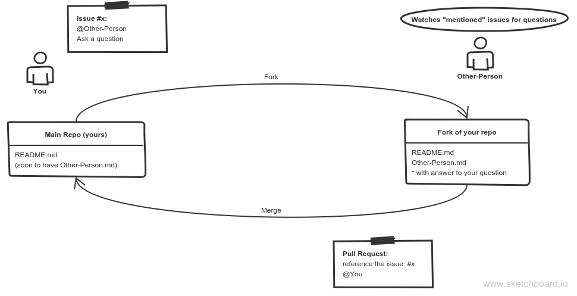

# Pull Requesting & Merging

There's a lot of code in your future, keeping track of it all is won't be easy.

Practice this simple exercise a few times a week so collaboration on GitHub feels easy before you start collaborating on full projects.

 

### Index
* [Learning Objectives](#learning-objectives)
* [Specifications](#specification)
* [Resources](#resources)

-------------

## Learning Objectives

* Pull Request workflow

[TOP](#index)

---

## Specifications

Right Now:
* On your portfolio repository: 
  * Include a link to the Projects page of your portfolio repository.  
  * You will open a new gh-project in your portfolio repository for each class project.
* Complete this mini-project:
  1. Setup - On your GitHub account:
    1. Open a new repository and call it something like "study-buddies".
    2. Make a simple README (so your repo can be forked)
  2. Project - take turns assigning issues and making pull requests:
    * Go around the circle taking turns as "project manager".
    1. The PM will ask questions:
      1. Create on issue in their repo for each person in the group
        * Use the issues to ask each person a question
        * Mention the person you're asking in the body of the issue (ie. @username)
    2. Each person will answer their PM's question:
        1. Find your mentioned issued in issues / mentioned
        2. Find the issue in it's home repo
        3. Create a fork of the PM's repo
        4. In the fork, create a new file and answer their question
        5. Send them a pull request, mention your issue in the body (ie. #3)
    3. The PM will accept or reject each answer:
        1. Check pull requests
        2. Review the answer
        3. Either merge, or ask for modifications
        4. Close the linked issue

[TOP](#index)

---

## Resources

GitHub Project Management Features:
* [Project Board Walk Through](https://medium.com/@dawsonbotsford/how-to-use-github-projects-aa15a8411b72)
* [Overview Article](https://www.lullabot.com/articles/managing-projects-with-github)
* [GitHub's PM Webinar](https://www.youtube.com/watch?v=6fByt0o4UYs)
* Guides:
  * [Managing your Work withIssues](https://help.github.com/articles/managing-your-work-with-issues/)
  * [Labeling Issues & PR's](https://help.github.com/articles/labeling-issues-and-pull-requests/)
  * [Tracking Progress with Projects](https://help.github.com/articles/tracking-the-progress-of-your-work-with-project-boards/)
  * [Tracking Progress with Milestones](https://help.github.com/articles/tracking-the-progress-of-your-work-with-milestones/)
  * [Finding Info in a Repo](https://help.github.com/articles/finding-information-in-a-repository/)

Workflow Methodologies:
* [Agile](https://www.visualstudio.com/learn/what-is-agile/)
* [Scrum](https://www.scrum.org/resources/what-is-scrum)
* [Lean](http://www.disciplinedagiledelivery.com/lean-principles/)
* [Kanban](https://www.sitepoint.com/how-why-to-use-the-kanban-methodology-for-software-development/)
* [Waterfall](https://airbrake.io/blog/sdlc/waterfall-model)
* [(VERY) Thorough Comparison](https://www.smartsheet.com/agile-vs-scrum-vs-waterfall-vs-kanban)

[TOP](#index)

___
___
### 
